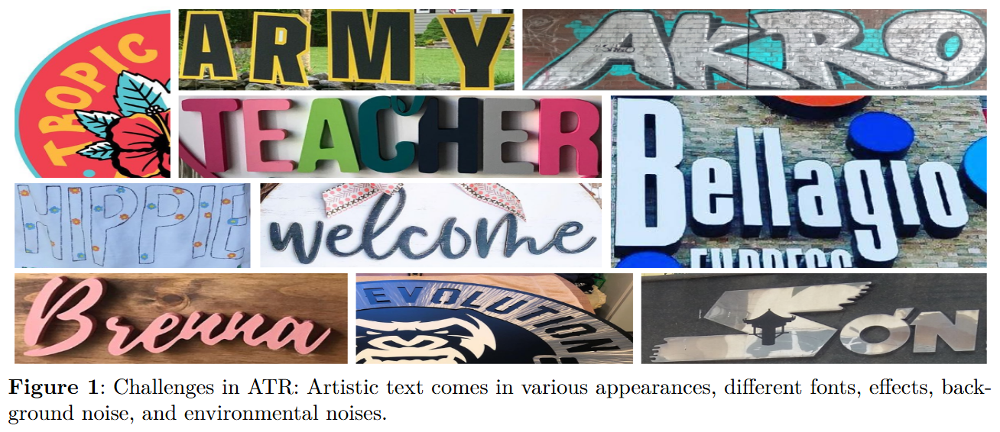
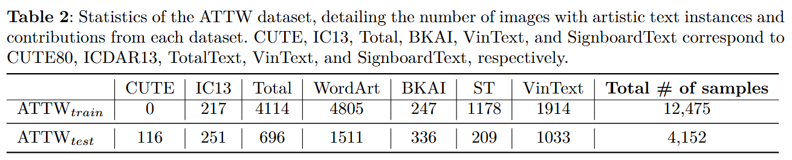
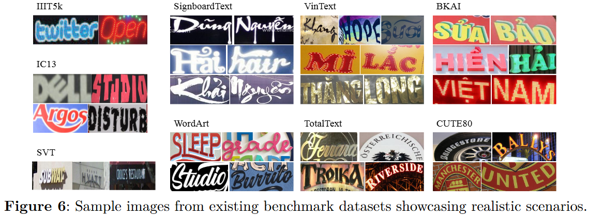
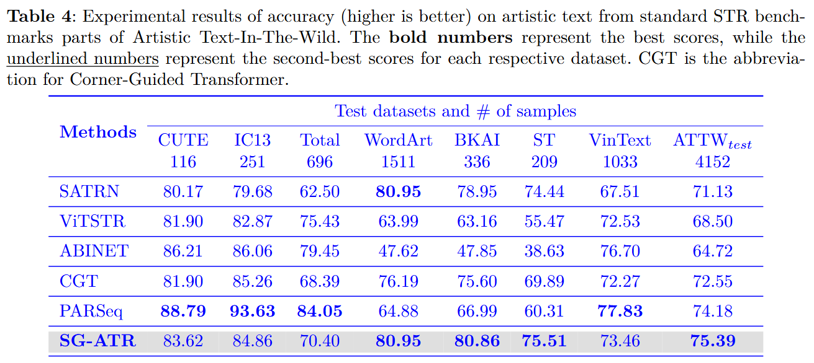

# Skeleton-Guided-Artistic-Text-Recognition

## Skeleton-Guided-Artistic-Text-Recognition

> Recognizing artistic text presents significant challenges due to its design by artists and professional designers, characterized by diverse fonts, text effects, layouts, personal styles, and complex backgrounds. Despite its importance, the problem of artistic text recognition remains insufficiently addressed within the research community. To address this gap, we introduce a benchmark dataset, Artistic Text-In-The-Wild (ATTW), consisting of 16,627 diverse instances of artistic text. ATTW serves as a comprehensive and diverse benchmark that captures a wide range of real-world artistic text variations, promoting the development and evaluation of more effective scene text recognition approaches. Furthermore, we propose a novel approach to artistic text recognition that emphasizes the use of skeletal information, positing that such information is essential for enhancing recognition accuracy. Experimental results demonstrate that the skeleton-guided method outperforms existing SOTA methods on the ATTW benchmark, highlighting the robustness and efficacy of the approach in tackling the unique challenges posed by artistic text.

This repository includes the code and data links mentioned in our papers, encompassing all the training data, evaluation scripts, and results utilized in our research.

<p align="center">
  
</p>

<br/>

<p align="center">
  
</p>

<br/>

<p align="center">
  
</p>


## Download dataset

To download the data, please send a request email to thuyentd@uit.edu.vn or tiendv@uit.edu.vn and tell us which school you are affiliated with. And by downloading this dataset, USER agrees:
> * to use this dataset for research or educational purposes only;
> * to not distribute or part of this dataset in any original or modified form;
> * and to cite our github repo whenever this dataset are employed to help produce published results.

```
|-- WordArt
|-- VietSignBoard
|-- VinText
|-- TotalText
|-- CUTE80
|-- ICDAR13
|-- BKAI_Text
|-- train_label.txt
|-- test_label.txt 
```

## Main results

<!-- <p align="center">
  
</p> -->

| Methods | CUTE (116) | IC13 (251) | Total (696) | WordArt (1511) | BKAI (336) | ST (209) | VinText (1033) | ATTW_test (4152) | Weights | Config |
|---|---:|---:|---:|---:|---:|---:|---:|---:|---|---|
| SATRN | 80.17 | 79.68 | 62.50 | **80.95** | 78.95 | 74.44 | 67.51 | 71.13 | |  |
| ViTSTR | 81.90 | 82.87 | 75.43 | 63.99 | 63.16 | 55.47 | 72.53 | 68.50 | [Drive Link](https://drive.google.com/drive/u/0/folders/1EZxpE7Cl1pm7s5lnhOo1nko75U-ks7ZQ) |  |
| ABINET | 86.21 | 86.06 | 79.45 | 47.62 | 47.85 | 38.63 | 76.70 | 64.72 | [Drive Link](https://drive.google.com/drive/u/0/folders/13YV1h0zAKiUqAEMJM61nzOGKo1QfEgsQ) |  |
| CGT | 81.90 | 85.26 | 68.39 | 76.19 | 75.60 | 69.89 | 72.27 | 72.55 | | |
| PARSeq | **88.79** | **93.63** | **84.05** | 64.88 | 66.99 | 60.31 | **77.83** | 74.18 | [Drive Link](https://drive.google.com/drive/u/0/folders/1tDY7y47gOtIUnB3uruxDZt4sjab3LAkU) | |
| **SG-ATR** | 83.62 | 84.86 | 70.40 | **80.95** | **80.86** | **75.51** | 73.46 | **75.39** | [Drive Link](https://drive.google.com/drive/u/0/folders/1P_897gEq-VxmWwr-RKCZ-nFY6ffe6yMJ) | [skeleton_guided_vnarttext_finetune.py](https://drive.google.com/file/d/1MbyrW-OR1Qf0x6IIUoQEGtLp7MefKjCg/view?usp=drive_link) |

## Training
```shell
python tools/train.py ${CONFIG_FILE} [ARGS]
```

For example, we use this script to train the model:
```shell
python tools/train.py src/WordArt/configs/textrecog/skeleton_guided/sekeleton_guided_vnarttext.py
```

## Citation

If you find this project useful in your research, please consider cite:

```BibTeX
@inproceedings{do2025skeleton,
  title={Skeleton-Guided Artistic Text Recognition},
  author={Do, Tien and Tran, Thuyen and Le, Khiem and Le, Duy-Dinh and Ngo, Thanh Duc},
  booktitle={International Conference on Document Analysis and Recognition},
  pages={303--320},
  year={2025},
  organization={Springer}
}
```

## Acknowledgement